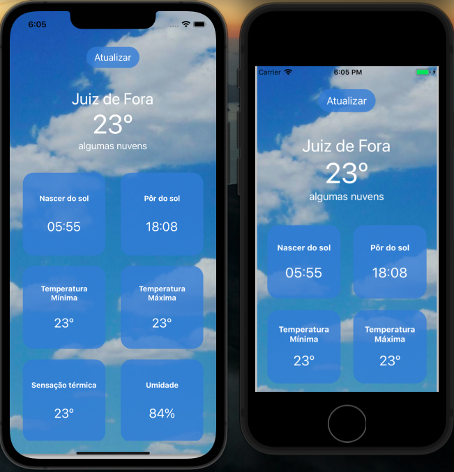
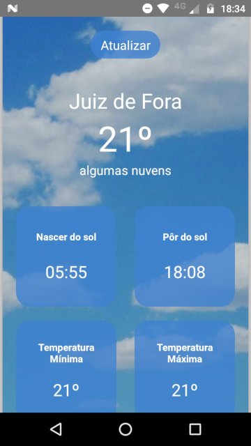

# Weather App

### 1. O projeto

Aplicativo que exibe alguns dados meteorológicos de acordo com a localização do usuário.
Este projeto foi construído utilizando TypeScript e React Native, seguindo boas práticas e com uma arquitetura limpa.





### 2. Executando o projeto

#### 2.1. Instalar dependências

Dentro da pasta do projeto, execute o comando abaixo no terminal:

```bash
$ yarn install
```

#### 2.2. Adicionar variáveis de ambiente

É necessário adicionar um arquivo na raiz do projeto chamado `.env` com as seguintes variáveis:

| Variável | Descrição | Tipo |
|--|--|--|
| ENV | Ambiente que o projeto está sendo executado | `dev` ou `production` |
| OPEN_WEATHER_API_URL | URL da API do Open Weather | string |
| OPEN_WEATHER_API_KEY | chave da API do Open Weather | string |


#### 2.3. Iniciar o servidor do packager

Execute o comando abaixo no terminal, independente da plataforma:
```bash
$ yarn start
```

#### 2.4. Rodando o App no IOS

Dentro da pasta do projeto, execute os comandos abaixo no terminal:
```bash
$ cd ios
$ pod install
```

Depois, execute o comando abaixo:
```bash
$ yarn ios
```

#### 2.5. Rodando o App no Android

Execute o emulador no Android Studio e dentro da pasta do projeto, execute o comando abaixo:

```bash
$ yarn android
```

---

### 3. Contato

[Linkedin - Yan Oliveira](https://linkedin.com/in/yloliveira) - **oliveira.yan02@gmail.com**

